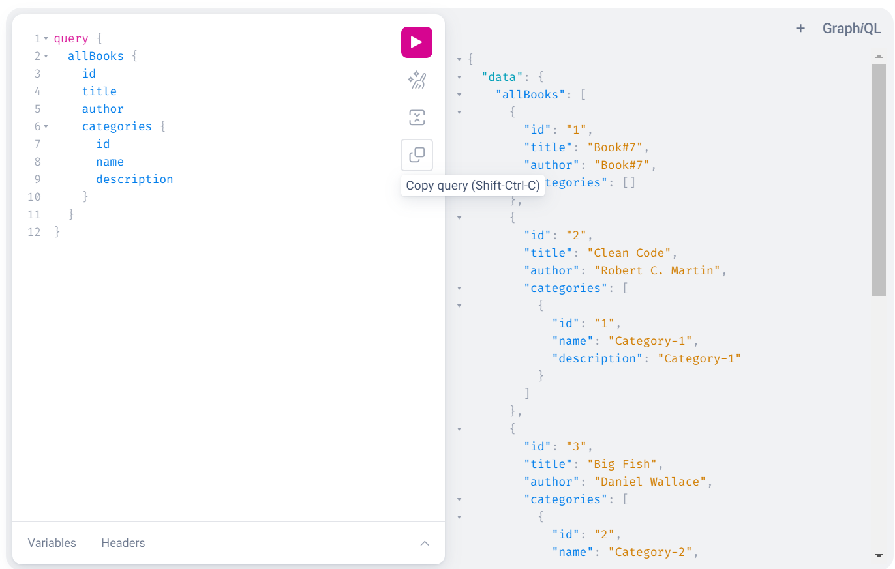
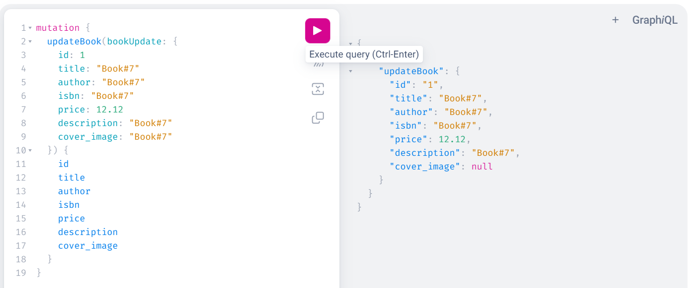
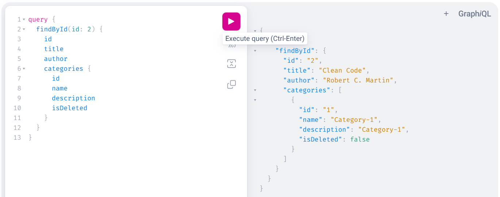

# GraphQL Spring Boot API

 **A simple Spring Boot API for testing common GraphQL types.**

## Technologies and tools:
* JDK 17
* Apache Maven 4.0.0
* Spring Boot Starter Web 3.2.2
* H2 Database (runtime)
* Liquibase 4.4.0

## Work with Application

**1. For use the application you should just download it and run it. **
**2. Liquibase will automatically create tables and insert data. **
**3. You can visit http://localhost:8080/graphiql and test common GraphQL queries. **

**Below are common GraphQL queries that will be available for testing: **

 

 

